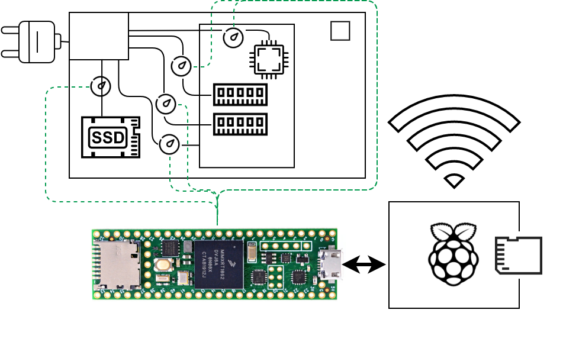
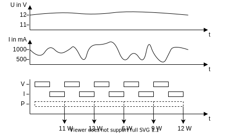
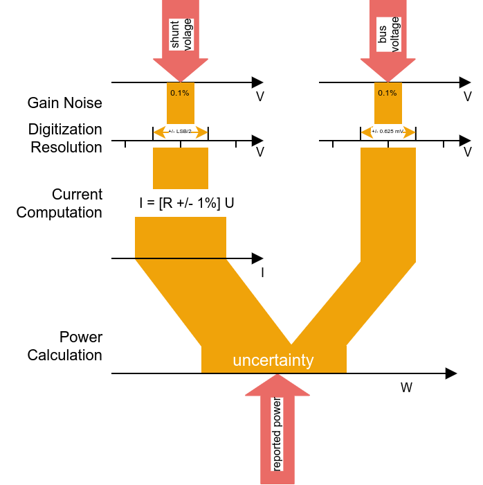

# Fast Fine-Grained Energy Measurements
This repository contains instructions on how to build a fast component-level energy measurement setup for desktop machines, as well as soure code to run and capture measurement data from it. For brevity, we call our system _FFEM_.

## Set-Up Overview
FFEM measures power consumption of desktop machines on component level with over 1.6 kHz for a whole system and over 2.7 kHz
for individual components. To do so, we interject the ATX power consumption of a system under measure (SUM) with instrumented ATX extension cables before each component of interest.
As Figure X shows, these instrumented ATX extension cables carry a power metering chip.
These chips' measurements are read out by a fast microcontroller through a common I²C bus.
This microcontroller finally forwards the collected measurements to a Linux-based client who aggregates and postprocesses, proceses, and stores the data.
<
FFEM can be built to measure any PC component that draws power from a cuttable wire, such as ATX wires. In addition, we propose solutions for ePCI components, such as GPUs, as well as DDR4 RAM bars.
FFEM becomes modular by instrumenting extension cables (and riser cards for ePCI and DDR4) instead of the original power wires.
This way, FFEM can easily be installed and removed without residue.

## Hardware
We give details on the specific hardware parts we chose for our system in this section. First, we explain why we chose the INA226 as power meter.
There is a set of mandatory parts that make up the core module, which we describe next.
Then, we describe how how to build a generic measurement module and give an overview over typical actual modules.
We give Bill Of Materials (BOM) for each module.

### Power Monitor
With this power measurement set-up, we wanted to
* measure power _accurately_
* be able to measure components s.a. CPU individually
* be able to add and remove the measurement system to and from a machine without residue
* measure fast (as fast as 1kH) to allow method-wise power estimations
* use widely available components and keep cost bellow expensive lab equipment (e.g., < 1000€) to promote reproducibility

In the following, we explain why the INA226 matches these requirements.

#### Accuracy
The INA226 calculates the drawn current by measuring the voltage drop over a shunt resistor with 16-bit resolution and applying Ohm's law.
This is a lot more accurate compared to e.g., the popular INA219 with only 12-bit resolution.
The INA226 measures voltage in steps of 1.25mV. Multiplying both voltage and current, it computes the used power.

What do these values mean for our use case? With 3.3V - 12V that a modern ATX power supply supplies, we measure the voltage with +/- 0.02% - 0.005% error.
Computing a relative current error is slightly more complicated.
The INA226 can measure positive, as well as negative voltage drops over the used shunt resistor, leaving us with 15-bit resolution for only the positive value range that our values will lie in.  
The shunt resistor must be chosen small enough such that no more than 81.92mV will ever drop over it. To optimize accuracy, however, we must keep the resistor's Ohmage as small as we can.

We can quickly get a rough estimate of a good Ohmage for the shunt resistor considering the thermal design power (TDP) of a typical component we want to measure.
The TDP is provided by the manufacturer and describes the maximum amount of heat generated (and thus power used) by a component.
A contemporary CPU, the Intel Core i5-10500, has a TDP of 65W and is powered by two 12V ATX lanes.
Each one needs to be measured individually, as we detail in the module descriptions.
To be on the safe side and to account for possible power peaks, we assume 65W maximum per lane.
At 12Vm this equals 5.4A maximum flowing through the current sensing resistor.
With Ohm's Law (R = U / I --> R=U²/P), we find that we need a 81.92mV/5.4A)=15.2mOhm Resistor.
We will most likely not have a resistor available at this exact Ohmage as common E-series resistor only go as low as 100mOhm.
Hence we must find a shunt aka current sensing resistor of less or equal Ohmage to ensure we can measure the intended current range.
Let's assume we use a 15mOhm shunt resistor. With Ohm' Law (R = U / I --> I = U / R) that, given the 2.5µV step size of the INA226, we can measure current in steps of 16µA, which translates to 2mW at 12 V.
Therefore, we have a measurement uncertainty of +/- 1mW, which is an error of  0.001% at the expected maximum power of 65W.

### Core Module
All parts of the core module must be present for FFEM to work. We need a microcontroller, an I²C bus, a linux client, and one or more power supplies for FFEM.

####  The Microcontroller
FFEM relies on a microcontroller as its central part in order to communicate with sensors over I²C. To enable the fastest power measurements possible, we chose the [Teensy 4.1 development board](https://www.pjrc.com/store/teensy41.html), the fastest commercially-available microcontroller board at the time of writing.
At its core is an ARM Cortex-M7 clocking at 600 MHz.
It features 3 I²C ports with up to 1 MHz frequency each, which allows it to sample the sensors very fast.
The board operates on 5V.

#### I²C bus
We use a prototype board with parallel copper lanes connecting 2.54mm-spaced holes. Hence, we only need to solder JST plugs onto the same lanes to form a bus.

#### Linux Client
The client's tasks are listening for measurement packages from the microcontroller over USB, processing and/or aggregating these measurements, and storing or forwarding over a network.
As these are not very demanding tasks, we chose a Raspberry Pi Model B, offering 4 USB port to connect up to 4 microcontrollers and a ethernet port to forward processed measurements.

#### Power Supplies
The Raspberry Pi as our Linux client requires a stable voltage that we can provide by using an official 5.1V Raspberry Pi power supply.
Other devices to be powered are the Teensy 4.1 micro controller and the INA226 power measurement chips:
*  The [Teensy 4.1 runs on 5V and draws approximately 100 mA](https://www.pjrc.com/store/teensy41.html#power).
*  Each INA226 needs 2.7V - 5.5 V to work [according to its spec sheet](https://www.ti.com/lit/ds/symlink/ina226.pdf). It typically draws 330µA quiescent current.
As explained later in the software section, we poll each INA226 robin-round for each of the 3 busses; therefore, 3 INAs at most may consume more power, lowering the risk of problematic current peaks.

Both devices will run on a 5V power supply.
A large set-up with 1 Teensy 4.1 and 30 INAs will only draw 110mA, so any we can easily supply all remaining devices withn an additional Raspberry Pi power supply.
To be on the safe side, it may be advisable to add a 1000µF capacitor to catch current peaks.

## Bill Of Materials (BOM)

### Instrumentation

| Item      | ~ Price  | Quantity |
| :----------- | ----: | -----------: |
| Teensy 4.1 development board | 25€ | 1 |
| INA 226 CJMCU | 5€ | 16 |
| 5V 200mA Power Supply | 10€ | 1 |
| Four-core stranded wire (per meter) | 1€ | 10 |
| bus prototype board | 3€ | 1 |

<!--To make the system modular, we also need:

| Item      | ~ Price  | Quantity |
| :----------- | ----: | -----------: |
| JST XH 2.54 4-Pin (Sets of Plug and Socket) | 0.20€ | 30 |
| INA 226 CJMCU | 5.00€ | 16 |
| 5V ???mA Power Supply | 10.00€ | 1 |
-->

### Lab Equipment
In case you are not equipped to solder and crimp, you might also need the following:

| Item      | ~ Price  | Quantity |
| :----------- | ----: | -----------: |
| Solder Station | 80€ | 1 |
| Solder | 1€ | 1 |
| Crimp Wrench | 20€ | 1 |
| Heat Gun  | 15€ | 1 |

### Raspberry Pi Client

| Item      | ~ Price  | Quantity |
| :----------- | ----: | -----------: |
| Raspberry Pi 3 B | 30€ | 1 |
| SD Card 32 GB | 10€ | 1 |
| Raspberry Pi Power Supply | 10€ | 1 |
| Teensy Connection Micro USB Cable | 2€ | 1 |

## Software
The software to measure the energy consumption of the INAs can be found in [famefetcher](./famefetcher). The software that runs the microcontroller can be found in [power-fetcher](./power-fetcher). Our local setup uses an MQTT server for data collection. For preserving the double-blind reviewing process, we cleared the configuration files, such that our institution is hidden.
